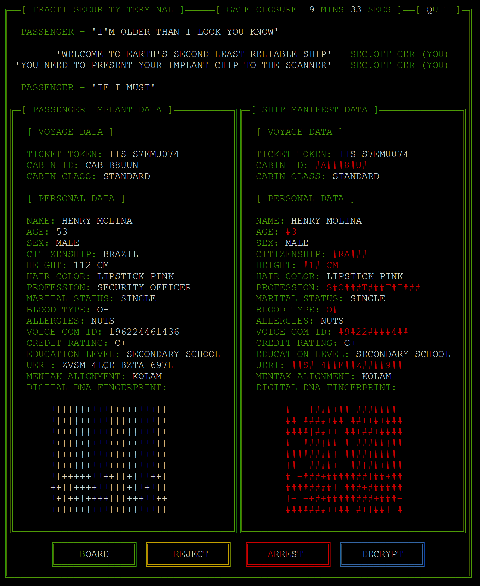

# Manifest
## **Game Overview**

Manifest is a retro, text based, observation and decryption game built purely in Python that runs in an emaulated terminal(xterm.js) and is deployed via Heroku.

You play the role of a spaceship security officer responsible for passenger boarding.
​

#### [The deployed website is here on Heroku](https://manifest.herokuapp.com/)​

## Table of contents:
1. [**Game Overview**](#game-overview)
1. [**Planning stage**](#planning-stage)
    * [***Planning Overview***](#planning-overview)
    * [***User Stories***](#user-stories)
    * [***Game Aims***](#game-aims)
    * [***Wireframes***](#wireframes)
    * [***Logic Flow***](#wireframes)
    * [***Color Scheme***](#color-scheme)
    * [***Design Choices***](#design-choices)
1. [**Game Features**](#game-features)
    * [***Main Menu***](#main-menu)
1. [**Testing**](#testing)
    * [***linter***](#linter)
1. [**Deployment**](#deployment)
1. [**Technology and Applications**](#technology-and-applications)
1. [**Future-Enhancements**](#future-enhancements)
    * [***User Enhancements***](#user_enhacements)
    * [***Internal Enhancements***](#internal_enhacements)
1. [**Credits**](#credits)
    * [**Honorable mentions**](#honorable-mentions)
    * [**Content**](#content)
    * [**Media**](#media)

---

## **Planning Stage**

### **Planning Overview:**

For this project I wanted to emulate an 80's scfi experience.
I explored what would be possible just using python and a terminal being emulated in xterm.js.
I decided to create record matching game with a decryption mini-game inside it

My core aims for the project

* Do as much as possible visually with a text terminal
* Have a static screen-space without scrolling
* 
* Add an element of procedural / random generation
* Provide

### **Target Audiences:**

* People that like puzzle games
* People that like text games
* People that like games with humor

### **User Stories:**

* As a player, I want a game with clear objectives
* As a player, I want simple inputs that provide responses
* As a player, I want an engaging experience

### **Game Aims:**

* The game should, provide a tutorial
* The game should, provide a main menu
* The game should, provide difficulty settings

### **Wireframes:**

I did produce an initial wireframe but didn't want to commit to a complex vision when design options would be limited in a terminal.

### **Logic Flow:**

I created a high level flowchart for the core game loop
​
### **Color Scheme:**

Working in a terminal, which in the case of xterm.js is limited to 8 colors did play a factor in my choices.

Core elements of the interface are green which is a nod to classic green monochrome terminals.
I used white for dialog text and

### **Design Choices**
​
Maximizing the use of screen-space

---
​
## **Game Features**

### **Intro**

The intro screen gives the player a feel for the game. I have a stacking animation that uses 16 random cards and slows down on the final card that is back face up and shows the Memoria logo.

The click to continue button drops in quickly so that a returning player can skip the animation.

#### *Desktop @1080p Example*

#### *Mobile Example*

---
## **Testing**

Throughout development I thoroughly tested each piece of code from a core logic perspective and a visual one, before commits.
My approach to testing is to do everything I can, from an end user perspective, to break the application. Always expect the unexpected click!
Please note all testing code & comments were removed from final production code.
The general dev cycle testing procedure was..

## **Defects**

### **Unresolved**

threading and curses seems to trigger vary rare screen coruption.

## **Deployment**
I deployed the page on GitHub pages via the following the standard procedure: -
​
1. From the project's [repository](https://github.com/Will-Griffiths-Ireland/Memoria), go to the **Settings** tab.
2. From the left-hand menu, select the **Pages** tab.
3. Under the **Source** section, select the **Main** branch from the drop-down menu and click **Save**.
4. A message will be displayed to indicate a successful deployment to GitHub pages and provide the live link.
​
You can find the live site via the following URL - [live webpage](https://will-griffiths-ireland.github.io/Memoria/)

Deployment to another host is also possible

1. From the project's [repository](https://github.com/Will-Griffiths-Ireland/Memoria), click **Code**.
2. Under the local tab click *Download Zip*.
3. Extract the files and copy them over to a webserver of your choice.

### **To fork the repository on GitHub** 
  
To make a copy of this GitHub repository that allows you to view the content and make changes without affecting the original repository, please take the following steps:
  
1. Login to <b>GitHub</b> and find [this repository](https://github.com/Will-Griffiths-Ireland/Manifest).
2. Locate the <b>Fork</b> button in the top, right hand side of the page.
3. Click on the <b>Fork</b> button to create a copy of the repository in your GitHub account.
4. Enjoy yourself and be creative, I welcome feedback if you have any to give!

---
​
## **Technology and Applications**
​
These are the technologies used for this project.

- Python 

----

## **Future-Enhancements**

### **User Enhancements**

* ?

### **Internal Enhancements**

* ?

## **Credits**
### **Honorable mentions**
​
Thanks to my mentor Richard who provided valuable input as always

​
### **Content:**
​
I created all the content for the game myself
  
### **Media:**
​
* The manifest logo was created via https://manytools.org/hacker-tools/ascii-banner/

