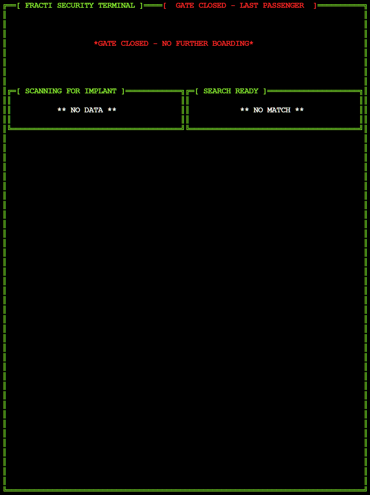

# Manifest
## **Game Overview**

Manifest is a retro, text based, observation and decryption game built purely in Python that runs in an emulated terminal(xterm.js) and is deployed via Heroku.

You play the role of a spaceship security officer responsible for passenger boarding during a security breach of the ships systems.

---
​

#### [The deployed website is here on Heroku](https://manifest.herokuapp.com/)​

## Table of contents:
1. [**Game Overview**](#game-overview)
1. [**Planning stage**](#planning-stage)
    * [***Planning Overview***](#planning-overview)
    * [***User Stories***](#user-stories)
    * [***Game Aims***](#game-aims)
    * [***Wireframes***](#wireframes)
    * [***Logic Flow***](#wireframes)
    * [***Color Scheme***](#color-scheme)
    * [***Design Choices***](#design-choices)
1. [**Game Features**](#game-features)
    * [***Logo & Main Menu***](#logo-mainmenue)
    * [***Tutorial***](#tutorial)
    * [***Security Terminal & Timer***](#security-terminal)
    * [***Shuttering Raises***](#shuttering-raises)
    * [***Dialog Area***](#dialog-area)
    * [***Passenger Implant Data Panel***](#passenger-implant-data-panel)
    * [***Ship Manifest Data Panel***](#ship-manifest-data-panel)
    * [***Decryption Game***](#decryption-game)
    * [***Action Buttons***](#action-buttons)
    * [***Gate Closure***](#gate-closure)
    * [***Performance Summary***](#perfomrance-summary)
1. [**Testing**](#testing)
1. [**Deployment**](#deployment)
1. [**Technology and Applications**](#technology-and-applications)
1. [**Future-Enhancements**](#future-enhancements)
    * [***User Enhancements***](#user_enhacements)
    * [***Internal Enhancements***](#internal_enhacements)
1. [**Credits**](#credits)
    * [**Honorable mentions**](#honorable-mentions)
    * [**Content**](#content)
    * [**Media**](#media)

---

## **Planning Stage**

### **Planning Overview:**

For this project I wanted to emulate an 80's sci-fi experience.
I explored what would be possible just using python and a terminal being emulated in xterm.js.
I decided to create record matching game with a decryption mini-game inside it that had elements of a text adventure in the mix.

My core aims for the project

* Do as much as possible visually with a text terminal
* Provide a fluid experience 
* Have a static screen-space without scrolling
* Include dialog as a nod to classic text adventure games
* Add an element of procedural / random generation of content
* Provide a fun challenge with rewards
* Limit users text entry
* Generate a feeling of pressure and being 'against the clock'

### **Target Audiences:**

* People that like puzzle games
* People that like text games
* People that like games with humor
* People that like Python 
* People that like retro sci-fi

### **User Stories:**

* As a player, I want a game with clear objectives
* As a player, I want simple inputs that provide responses
* As a player, I want an engaging experience
* As a player, I want to know how to play
* As a player, I want see a score / result

### **Game Aims:**

* The game should, provide a tutorial
* The game should, provide a main menu
* The game should, provide difficulty settings

---

### **Wireframes:**

I produced an initial wireframe but didn't want to commit to a complex vision when design options would be limited in a terminal. My game grew from that

---

### **Logic Flow:**

I built out the high level logic flow in draw.io.

---
​
### **Color Scheme:**

Working in a terminal, which in the case of xterm.js is limited to 8 colors did play a factor in my choices. Luckily I had the main colours I wanted for the game.

- Core elements of the interface are green which is a nod to classic green monochrome terminals.
- I used white for dialog text and most of the fields with changing data.

- Yellow is used occasionally for a bit of variation and to emulate system interactions such as the scanner reading an implant.

- Red is used for encrypted fields and arrest dialog.

- Blue is used in the decryption game system to separate it from the core game.

- Magenta is used in the employee terminal and performance summary section

### **Design Choices**
​
Maximizing the use of screen-space was important in the overall design of the game.

I felt it was essential to have a very static layout for as much of the game area as possible so that the changing game elements would be challenging but not frustrating to spot.

A somewhat dystopian aesthetic is threaded through the dialog interactions but with a edge towards dark humor.

#### **Defensive Design**

An important element of any program is defending from user generated issues. Any time we get input from a user we are exposed.

From the outset I decided to limit user input as much as I could.

- I capture key press events in loops and then check for valid keys in relation to player actions.
- I clear input buffers to avoid unintended progression.
- I built a function to take input from the user during the decryption game which only allows specific keys and warns the user about invalid key presses

---
​
## **Game Features**

### ***Logo & Main Menu***

For the logo I wanted to simulate a type of digital distortion fade that was connected with the games core story point of a hackers

- The manifest logo is built up from a file read into a list
- A random red green or blue colour is picked for each character on each pass
- The logo is then drawn to screen in multiple passes
- A partial trail is left based on the last line of characters drawn
- The logo transitions up the screen
- The number of blanks is reduced as the logo moves up.
- The final pass draws the logo fully to screen

The menu items are selected with the relevant key
- Contrasting colours for the starting letter indicate the relate key to press

After the first load of the game the animation time is changed for the main menu so that latter calls load it quickly

#### *Example*

---

### **Tutorial**

The tutorial section explains the setup for the game and the core objectives.

A second page explains the difficulty options and settings

I did have plans to build an interactive tutorial that would be part of the game but time constraints did not allow for this and its a possible future enhancement.

---

### **Security Terminal & Timer**

* The terminal and window structure used throughout the game is drawn with a function I built that allows me to specify a 'window' with starting position, dimensions, and fill style
* I tried to maximize the use of screen space and it was a deliberate design choice to have it packed with data to analyze 

The timer was difficult to implement since I wanted to avoid full refreshes of the entire terminal.
* I used the threading library to display a countdown that is constantly updating
* I had to use global fags to hide the gate closure timer during the decryption game
* The purpose is to remind the player they are against a clock.
* The time shifts to yellow and then red once it reaches certain percentage thresholds

---
### **Shuttering Raises**

At the start of each run the shuttering on the security hatch raises.
Its just another little touch that adds to the immersion of the game.
This only displays before the first passenger.

---
### **Dialog Area**

- The dialog area displays passenger comments / actions / mood and the security officers (your) comments / actions / mood
- The aim was to add some richness and comedy to the game but they also connect to the core mechanic of catching out the infiltrators.
- Random selection of randomly shuffled lines in lists leads to some interesting interactions
- The passengers that get generated as the hackers have some custom dialog that points towards their guilt

---
### **Passenger Implant Data Panel**

The core part of the game is checking the passengers implant chip which acts as a digital passport and boarding pass.
The policy is simple. It has to match the ships stored data in the manifest or they don't get on.

- Their is a passenger class that generates random passengers and their details
- Fields that are alpha numeric strings are randomly generated when the passenger is but the function checks the existing passenger list for any passenger that already had the number/key generated for them.
- Other attributes which are not expected to be unique to the character are randomly assigned from lists.
- During the passengers creation they have a weighted random chance at getting a threat level of medium or high
- Passengers being created with a medium or high threat level have their implant data modified and this is what the player must spot.
- Medium threat passengers are treated an innocent but still not be boarded and need to be rejected
- Medium threat passengers have a random field completely changed
- High threat passengers are less common and get generated with only a single character that is different in one field
- The exception to this is the DNA fingerprint which seemed too punishing to have a single character to spot, so in this case multiple characters are flipped

The animation timings are ever so slightly delayed when drawing the panel. This is to simulate the transfer of data from the implant chip

---
### **Ship Manifest Data Panel**

- The ticket token is the primary key and never encrypted or suspect
- The manifest data is also part of the passenger object and is the source of truth within the game.
- The only catch is its getting encrypted by an ongoing hack
- The manifest data is randomly encrypted (obfuscated) before it is drawn to screen.
- The games difficulty determines how many fields are encrypted and how much of the field is still shown
- There is a very rare chance at the lowest difficulty that no fields will be encrypted
- At the hardest difficulty almost all the fields are totally covered
- If the player beats the decryption game then the manifest record is fully recovered and displayed.

---
### **Action Buttons**

- The action buttons are a visual que to the player on what they can do next
- Only displayed when they can hit a key
- Hidden during dialog, panel drawing and in the decryption game
- All of them follow the same approach as the menu items and have the letter of the key assigned to the action in a contrasting color
- Once a decrypt attempt has been run that button is no longer shown
- Board / Reject / Arrest all trigger different dialog responses based on multiple variables
- Player actions are stored in the passenger object for later use

---
### **Decryption Game**

The decryption game took considerable work to get functioning but I think was worth it and add another level to the game.

- Based on the difficulty the key changes in size
- The number of fake keys also changes with difficulty
- The screen is filled with junk data
- The key is injected randomly
- The fake keys are then spread out randomly across lines and then if all lines are taken it looks for a space that doesn't overlap other injected keys
- This caused me great pains back at the start when I had 120+ fakes but after play testing the feedback was the game was too hard with just 5 chances in 60 seconds and I scaled back the numbers greatly.
- There is also a 60 second bar countdown that reduces to the center and changes in colour as the time runs out

I built a custom function to handle the player input and echo it back to the screen
- Validates the key against a list
- Calls another function to warn the user if the input is too long
- Handles backspace so the play can remove characters 
- I needed to check the screen position of the cursor due to a conflict with the thread that is drawing the countdown. This was required or there were strange results with the printing of player key presses.I used a global var to store the player key entry area and had the countdown timers thread set the cursor position back to that once it had done its update.

Once the player hits enter to check their entered characters then get visual feedback
- Green is an exact character match
- Red is a character not in the key at all
- Yellow means the character is in the key at least once but not in that location

Once the time is up the player fails and cannot unlock the record. If they win/fail they get a message and then after hitting a key get taken back to the main game screen
If they won the game then the manifest record is unlocked and displayed in full

---
### **Gate Closure**

- When the run comes to an end the gate counter closure timer reaches zero and the player gets to handle the last passenger
- Once that last passenger has been actioned the gate fully closes
- Gate closure message shows along with last line of dialog from the officer

---
### **Performance Summary**

I thought hard about how to build a result or score into the game.
So this section of the game is simulating a jump cut to later in the day when the officer is 'relaxing' with 'hypno box' on their personal terminal. The reference here is to Hypnotoad in Futurama.

- The officers terminal is being populated with hundreds of colours boxes in a hypnotic pattern
- These are randomly generated in a function
- They are quickly closed because of an message from the officers boss.
- The player then gets their performance stats because the hack has been resolved and all of their work was automatically audited
- All of the details are calculated from the objects in the passenger list
- Credits are based on how well they processed passengers.
- The max credits are what they could have made by unlocking every record and performing the correct action on each passenger.
- The penalties are high and can result in minus credits and a very poor rating.

---
## **Testing**

Testing documentation is [here](./TESTING.md)

## **Deployment**

I deployed the program on heroku and used automatic deployment so I could verify all features as I committed code
​

​

### **To fork the repository on GitHub** 
  
To make a copy of this GitHub repository that allows you to view the content and make changes without affecting the original repository, please take the following steps:
  
1. Login to <b>GitHub</b> and find [this repository](https://github.com/Will-Griffiths-Ireland/Manifest).
2. Locate the <b>Fork</b> button in the top, right hand side of the page.
3. Click on the <b>Fork</b> button to create a copy of the repository in your GitHub account.
4. Enjoy yourself and be creative, I welcome feedback if you have any to give!

---
​
## **Technology and Applications**
​
These are the technologies used for this project.

- Python
- Python - [Curses Lib](https://docs.python.org/3/howto/curses.html)
- Gitpod
- Github
- draw.io 
- Heroku

----

## **Future-Enhancements**

### **User Enhancements**

* decrypt game uses letters as identifiers so the player just hits the relevant key
* enhance dialog and add player interaction / qustioniung
* Build interactive tutorial that runs with game

### **Internal Enhancements**

* Upgrade from WILLTxtDB to a better method of storing data :)
* Refactor code to be shorter and cleaner

## **Credits**
### **Honorable mentions**
​
Thanks to my mentor Richard who provided valuable input as always

​
### **Content:**
​
I created all the content for the game myself. Inspiration for this game was taken from the game [Papers Please](https://en.wikipedia.org/wiki/Papers,_Please)​by Lucas Pope
  
### **Media:**
​
* The manifest logo was created with https://manytools.org/hacker-tools/ascii-banner/

