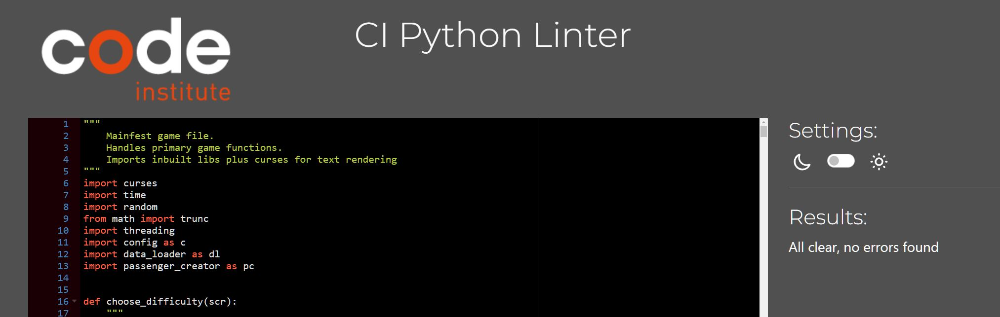
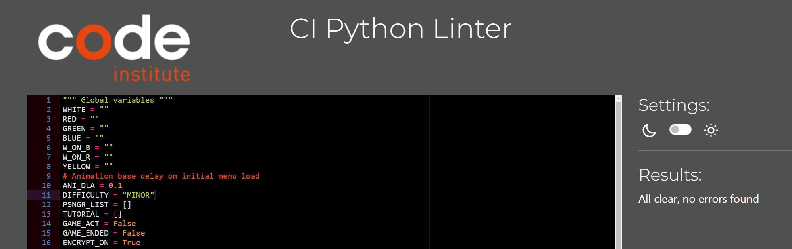
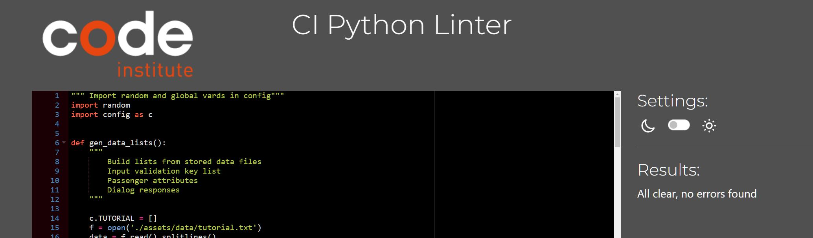
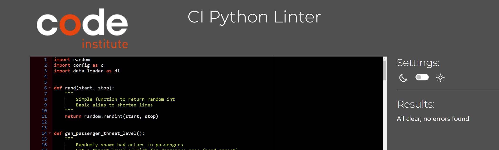

# Manifest Testing
## Table of contents:
1. [**Testing Overview**](#testing-overview)
1. [**Linter Results**](#manual-tests)
1. [**Manual Tests**](#manual-tests)
    * [***Test & Result***](#planning-overview)
    * [***Testing Feedback***](#planning-overview)
1. [**Know Issues**](#know-issues)
---
### **Testing Overview**

Throughout the project I was learning, coding, and testing as I went along. This was my first experience with python and I've progressed a lot.

- I had 6 other people test my game and I collected their input

In addition to the manual tests I did build test functions.

I did not keep a record of these and few if any were left in any committed code. In future I will store any testing code and the results for reference.

As an example I built a function to generate thousands of passenger objects. The test did pass and it gave me a good idea of how often I was generating medium and high risk passengers.
It also exposed a performance issue once past about 5000 passengers where the loops checking existing passengers really start to slow things down. This was in noway a concern for my game but did open my eyes to performance testing in bigger scale games.

---
### **Linter Results**

All of my files had zero issues reported in CI Linter

---

### **Manual Tests**
#### ***Test & Result***

    1 - Main menu displays correctly  

    Result - PASS

---
    2 - Main menu key selection and progression works  

    Result - PASS
---
    3 - Main menu key selection and progression works  

    Result - PASS
---
    4 - Tutorial screen triggered by 't' key and displays tutorial text, progresses to page 2 on key press and then returns to main menu after next key press

    Result - PASS
---
    5 - Quit triggered by 'q' key and exits the program

    Result - PASS
---
    6 - New game triggered by 'n' key

    Result - PASS
---
    7 - Game difficulty selection displays and allows selection with keys '1','2', and '3'. Stores selection in global var.
    Selection triggers progression to duration selection

    Result - PASS
---
    8 - Duration selection displays and triggers with keys 1 to 5. Stores result in global var. Initiates main game display.

    Result - PASS
---
    9 -
    - Main game screen draws
    - Timer displays correct countdown and updates each second
    - Shutter 'animation' runs. 
    - Dialog starts. 
    - Implant read sequence runs
    - Implant data displays with correct delay to emulate data transfer
    - Manifest match sequence runs
    - Manifest data has been randomly encrypted and displays with in red with hashes
    - Action 'buttons' display - Quit / Board / Reject / Arrest / Decrypt

    Result - PASS
---
    10 - 
    - Hitting relevant key triggers correct action
    - Q triggers quit game confirm
    - B triggers boarding passenger
    - R triggers rejecting passenger
    - D triggers decryption game
    - not other keys trigger an actions or errors

    Result - PASS
---
    11 - 
    - Q triggers quit confirmation
    - N triggers confirmation closure and play continues
    - Y triggers the game to end and the main menu to display

    Result - PASS
---
    12 - 
    - D triggers decryption game to run
    - New window displays
    - Countdown starts
    - Random fake keys listed with 1 correct key
    - User input only allows valid alpha numeric characters
    - Backspace deletes and enter submits the current pattern
    - Empty input is valid (easy way to skip game)
    - Input limited to current key length and user gets warning
    - Feed displays last entered key
    - Correct characters in green, yellow partial match, red not in string
    -Entering the correct key displays valid key record recovered
    - Use up all 5 chances and failure message displays.
    - Countdown reaches 0 and failure message displays along with timeout message
    - Fail/Win/Countdown expires results in switch back to main game

    Result - PASS
---
    13 - 
    - Decryption game ending results in main game displaying.
    - If gate closure time expires while in mini game show the gate closed message in timer location
    - action buttons redrawn without decrypt option
    - If game was failed then screen remains unchanged
    - If game was won then

    Result - PASS